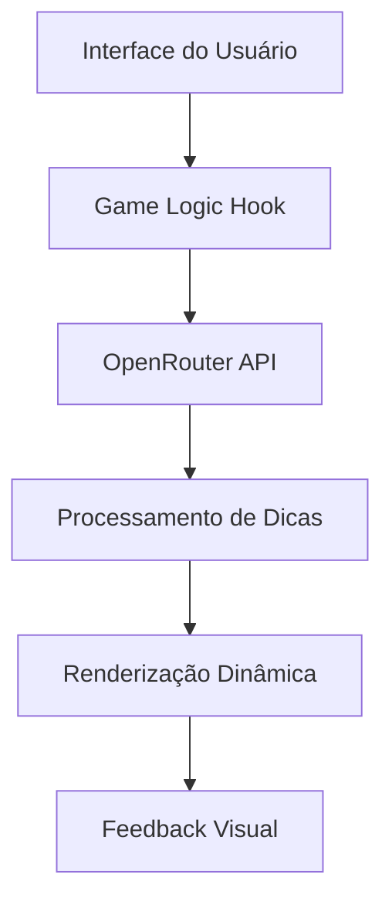

# 🎬 HangmanAigame - Jogo da Forca com Filmes 🎮

<div align="center">
  <!-- Substitua por um GIF hospedado diretamente no repositório ou use este formato -->
  
</div>

## 📝 Visão Geral

O **MovieHangman** é um jogo da forca moderno que utiliza a API do OpenRouter para gerar dicas e filmes aleatórios. Desenvolvido em React Native, o app combina aprendizado de máquina com diversão clássica, oferecendo uma experiência desafiadora e educativa.

## ✨ Features Principais

- 🎥 **Filmes aleatórios** via API OpenRouter
- 🕵️‍♂️ **Sistema inteligente de dicas** que aparecem progressivamente
- ⏱ **Temporizador desafiador** com liberação programada de dicas
- 🖌 **Renderização dinâmica** do boneco da forca
- ⌨ **Teclado virtual otimizado** para mobile
- 🏆 **Sistema de vitória/derrota** com feedback visual
- 📱 **Design responsivo** para todas as telas

## 🛠 Tecnologias Utilizadas

### **Frontend**

- React Native (Expo)
- TypeScript
- Context API (para gerenciamento de estado)
- Styled Components

### **Backend/IA**

- OpenRouter API
- Modelos de IA para geração de dicas contextuais
- Sistema de temporização inteligente

### **Infraestrutura**

- Expo SDK
- GitHub Actions (CI/CD)
- ESLint + Prettier (padronização de código)

## 🧠 Arquitetura do Sistema



## 🚀 Como Executar

### **Pré-requisitos**

- Node.js (v18+)
- Yarn ou npm
- Expo CLI instalado globalmente
- Conta no OpenRouter (para chave de API)

### **Instalação**

```bash
git clone https://github.com/cezardsilva/hangmanAigame.git
cd hangmaiAigame
yarn install
```

### **Configuração**

Crie um arquivo `.env` na raiz do projeto:

```env
OPENROUTER_API_KEY=sua_chave_aqui
```

### **Executando o App**

```bash
expo start
```

## 📱 Build e Deploy

Para construir o APK/IPA:

```bash
expo build:android
# ou
expo build:ios
```

## 🧪 Padrões de Código

- **ESLint**: Configuração Airbnb com modificações
- **Prettier**: Padrão de formatação consistente
- **Conventional Commits**: Padrão para mensagens de commit
- **JSDoc**: Documentação de funções e componentes

## 📊 Métricas de Qualidade

[](https://github.com/seu-usuario/movie-hangman/actions)
[](https://github.com/seu-usuario/movie-hangman/actions)
[](https://docs.expo.dev/versions/latest/)

## 🤝 Como Contribuir

1. Faça um fork do projeto
2. Crie uma branch (`git checkout -b feature/AmazingFeature`)
3. Commit suas mudanças (`git commit -m 'Add some AmazingFeature'`)
4. Push para a branch (`git push origin feature/AmazingFeature`)
5. Abra um Pull Request

## 📄 Licença

Distribuído sob a licença MIT. Veja `LICENSE` para mais informações.

## ✉️ Contato

Desenvolvedor: [Cezar D Silva](https://github.com/cezardsilva)  
Email: <cezardsilva@gmail.com>
LinkedIn: [Cezar D Silva](https://linkedin.com/in/cezardsilva)

---
